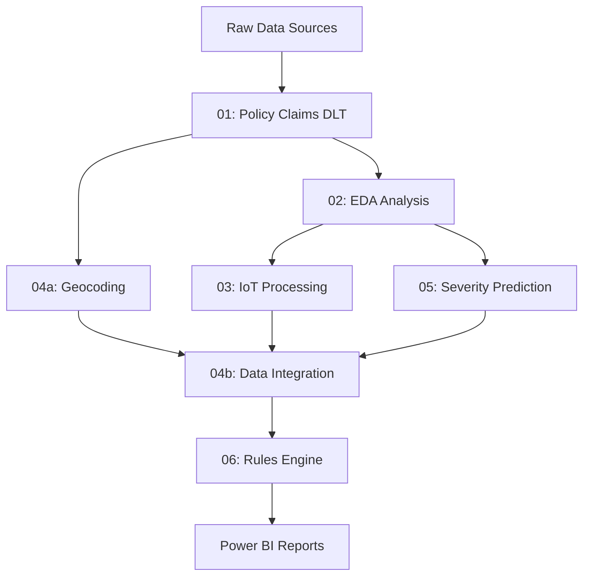

# Microsoft Fabric Smart Claims Pipeline Deployment Guide

## 🚀 Overview

This guide helps you deploy the Smart Claims solution in Microsoft Fabric, equivalent to the original Databricks pipeline. The Fabric deployment uses Data Pipelines, Notebooks, and Lakehouses to achieve the same business objectives.

## 📋 Prerequisites

### Fabric Requirements
- ✅ Microsoft Fabric workspace with Premium capacity
- ✅ Contributor or Admin role in the Fabric workspace
- ✅ Lakehouse created for data storage
- ✅ Git integration enabled (optional but recommended)

### Data Requirements
- 📄 Claims data (JSON format)
- 📄 Policy data (CSV format)
- 📸 Accident images with metadata
- 📊 Telematics data (Parquet format)

## 🏗️ Architecture Comparison

### Databricks vs Fabric
| Component | Databricks | Microsoft Fabric |
|-----------|------------|------------------|
| **Orchestration** | Workflows/Jobs | Data Pipelines |
| **Compute** | Clusters | Spark Compute |
| **Storage** | DBFS/Delta | OneLake/Delta |
| **Notebooks** | Databricks Notebooks | Fabric Notebooks |
| **DLT** | Delta Live Tables | Manual Delta Operations |
| **Dashboards** | Databricks SQL | Power BI |

## 🗂️ File Structure

```
Fabric Lakehouse Files/
├── data_sources/
│   ├── Claims/           # JSON claim files
│   ├── Policies/         # CSV policy files  
│   ├── Accidents/        # Image files + metadata
│   └── Telematics/       # Parquet files
└── pipeline_configs/     # Configuration files
```

## 📊 Pipeline Architecture



## 🎯 Deployment Steps

### Step 1: Create Fabric Resources

1. **Create Lakehouse**
   ```
   Workspace → + New → Lakehouse → "smart-claims-lakehouse"
   ```

2. **Upload Data**
   - Navigate to `Files` in your lakehouse
   - Create folder structure as shown above
   - Upload your data files to appropriate folders

### Step 2: Import Notebooks

Import the Fabric-converted notebooks in this order:

| Order | Notebook | Purpose |
|-------|----------|---------|
| 1 | `01_policy_claims_accident_sourceToBronze.py` | Core data ingestion to bronze |
| 2 | `02_policy_claims_accident_bronzeToSilver.py` | Core data ingestion to silver |
| 3 | `03_iot.py` | Telematics processing |
| 4 | `04a_policy_location.py` | Geocoding enhancement |
| 5 | `05_severity_prediction.py` | AI damage assessment |
| 6 | `06_rule_fabric.py` | Business rules engine |

### Step 3: Create Data Pipeline

1. **Create New Data Pipeline**
   ```
   Workspace → + New → Data Pipeline → "Smart Claims Pipeline"
   ```

2. **Configure Pipeline Activities**

#### Activity 1: Setup and Data Validation
```json
{
  "name": "00_setup_validation",
  "type": "Notebook",
  "notebook": "00_setup_fabric",
  "timeout": "00:30:00"
}
```

#### Activity 2: Policy Claims Processing
```json
{
  "name": "01_policy_claims_dlt",
  "type": "Notebook", 
  "notebook": "01_policy_claims_accident_fabric",
  "dependsOn": ["00_setup_validation"],
  "timeout": "01:00:00"
}
```

#### Activity 3: Parallel Processing Branch
```json
{
  "name": "parallel_processing",
  "type": "ExecutePipeline",
  "activities": [
    {
      "name": "02_eda_analysis",
      "type": "Notebook",
      "notebook": "02_EDA_fabric",
      "dependsOn": ["01_policy_claims_dlt"]
    },
    {
      "name": "04a_geocoding", 
      "type": "Notebook",
      "notebook": "04a_policy_location_fabric",
      "dependsOn": ["01_policy_claims_dlt"]
    }
  ]
}
```

#### Activity 4: Data Enhancement
```json
{
  "name": "data_enhancement",
  "type": "ExecutePipeline", 
  "activities": [
    {
      "name": "03_iot_processing",
      "type": "Notebook",
      "notebook": "03_iot_fabric", 
      "dependsOn": ["02_eda_analysis"]
    },
    {
      "name": "05_severity_prediction",
      "type": "Notebook",
      "notebook": "05_severity_prediction_fabric",
      "dependsOn": ["02_eda_analysis"]
    }
  ]
}
```

#### Activity 5: Final Integration
```json
{
  "name": "06_rules_engine",
  "type": "Notebook",
  "notebook": "06_rule_fabric",
  "dependsOn": ["data_enhancement", "04a_geocoding"],
  "timeout": "00:45:00"
}
```

### Step 4: Configure Environments

#### Notebook Parameters (Apply to all notebooks)
```json
{
  "lakehouse_name": "smart-claims-lakehouse",
  "workspace_name": "your-workspace-name", 
  "environment": "production",
  "debug_mode": false
}
```

#### Environment Variables
```json
{
  "FABRIC_WORKSPACE": "your-workspace-name",
  "LAKEHOUSE_NAME": "smart-claims-lakehouse",
  "CLAIMS_PATH": "Files/data_sources/Claims/",
  "POLICIES_PATH": "Files/data_sources/Policies/",
  "ACCIDENTS_PATH": "Files/data_sources/Accidents/",
  "TELEMATICS_PATH": "Files/data_sources/Telematics/"
}
```

## 🔧 Configuration Files

### Pipeline Configuration JSON
```json
{
  "pipeline": {
    "name": "Smart Claims Processing Pipeline",
    "description": "End-to-end claims processing with AI-powered insights",
    "schedule": {
      "frequency": "Daily",
      "time": "02:00:00",
      "timezone": "UTC"
    },
    "retryPolicy": {
      "retryIntervalInSeconds": 300,
      "maximumRetries": 3
    },
    "notifications": {
      "onSuccess": ["admin@company.com"],
      "onFailure": ["admin@company.com", "ops@company.com"]
    }
  }
}
```

## 📈 Monitoring and Alerts

### Key Metrics to Monitor
- **Data Volume**: Record counts per table
- **Processing Time**: Notebook execution duration  
- **Data Quality**: Null rates, schema validation
- **Pipeline Health**: Success/failure rates

### Alert Configuration
```json
{
  "alerts": [
    {
      "name": "Pipeline Failure Alert",
      "condition": "Pipeline execution fails",
      "action": "Send email notification"
    },
    {
      "name": "Data Quality Alert", 
      "condition": "Null rate > 10% in critical columns",
      "action": "Send Teams notification"
    },
    {
      "name": "Processing Time Alert",
      "condition": "Execution time > 2 hours", 
      "action": "Send email notification"
    }
  ]
}
```

## 🎨 Power BI Integration

### Semantic Model Configuration
1. **Connect to Lakehouse**
   ```
   Power BI → Get Data → Microsoft Fabric → Lakehouse
   ```

2. **Key Tables to Import**
   - `silver_claim_policy` - Core claims data
   - `silver_claim_policy_location` - Geocoded claims  
   - `silver_telematics` - IoT data
   - `silver_accident` - Severity predictions
   - `gold_claims_final` - Final enriched data

### Sample DAX Measures
```dax
// Total Claims Value
Total Claims Value = SUM(silver_claim_policy[claim_amount])

// Average Severity Score  
Avg Severity = AVERAGE(silver_accident[severity])

// Claims by Severity Category
High Severity Claims = 
CALCULATE(
    COUNT(silver_accident[image_name]),
    silver_accident[severity] >= 0.8
)
```

## 🚀 Deployment Automation

### GitHub Actions Workflow (Optional)
```yaml
name: Deploy Smart Claims to Fabric
on:
  push:
    branches: [main]
    
jobs:
  deploy:
    runs-on: ubuntu-latest
    steps:
      - uses: actions/checkout@v2
      - name: Deploy to Fabric
        env:
          FABRIC_TOKEN: ${{ secrets.FABRIC_TOKEN }}
        run: |
          # Deploy notebooks and pipeline configuration
          # Update data pipeline settings
```

## 🔍 Testing Strategy

### Unit Testing
- Test each notebook independently
- Validate data transformations
- Check schema compliance

### Integration Testing  
- Run full pipeline with sample data
- Verify data lineage
- Test error handling

### Performance Testing
- Measure processing times
- Test with production data volumes
- Optimize Spark configurations

## 📚 Best Practices

### Data Management
- ✅ Use Delta format for all tables
- ✅ Implement proper partitioning
- ✅ Regular table optimization
- ✅ Data retention policies

### Security
- ✅ Row-level security where needed
- ✅ Proper access controls
- ✅ Data masking for sensitive fields
- ✅ Audit logging enabled

### Performance
- ✅ Optimize Spark configurations
- ✅ Use appropriate file sizes
- ✅ Implement caching strategies
- ✅ Monitor resource usage

## 🆘 Troubleshooting Guide

### Common Issues

#### Issue 1: Import Errors
```
Problem: PySpark imports not found
Solution: Ensure notebooks are run in Fabric environment, not local VS Code
```

#### Issue 2: File Path Issues  
```
Problem: Files not found in specified paths
Solution: Verify lakehouse structure and file upload completion
```

#### Issue 3: Memory Issues
```
Problem: Out of memory during processing
Solution: Adjust Spark configurations, use smaller batch sizes
```

#### Issue 4: Delta Table Conflicts
```
Problem: Concurrent write conflicts
Solution: Implement proper checkpointing and retry logic
```

## 📞 Support Resources

- **Microsoft Fabric Documentation**: [aka.ms/fabric-docs](https://aka.ms/fabric-docs)
- **Community Support**: [Microsoft Fabric Community](https://community.fabric.microsoft.com/)
- **Training**: [Microsoft Learn - Fabric](https://learn.microsoft.com/training/paths/get-started-fabric/)

## 🏁 Success Criteria

### Deployment Complete When:
- ✅ All 6 notebooks successfully imported
- ✅ Data pipeline created and validated
- ✅ Sample data processed end-to-end
- ✅ Power BI reports connected and functional
- ✅ Monitoring and alerts configured
- ✅ Documentation updated for your environment

---

## 🎯 Next Steps After Deployment

1. **Data Integration**: Connect your actual data sources
2. **Model Training**: Replace simulated ML models with trained models  
3. **Business Logic**: Customize rules engine for your business requirements
4. **Reporting**: Build comprehensive Power BI dashboards
5. **Monitoring**: Implement production monitoring and alerting
6. **Optimization**: Fine-tune performance based on actual data volumes

---

*This deployment guide provides a complete roadmap for migrating your Smart Claims solution from Databricks to Microsoft Fabric. Follow the steps sequentially for best results.*
